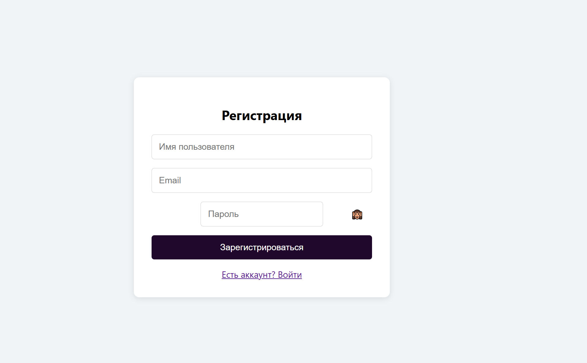
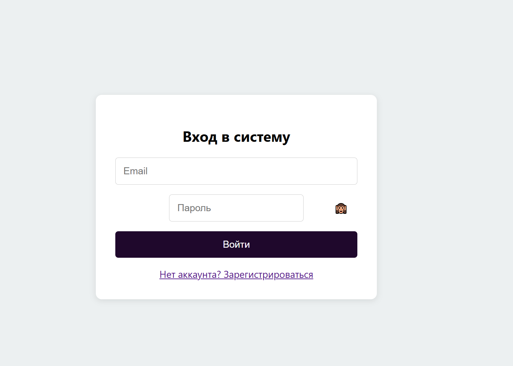
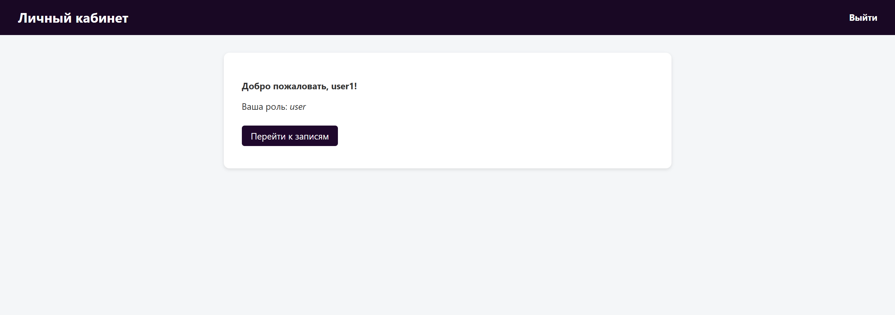
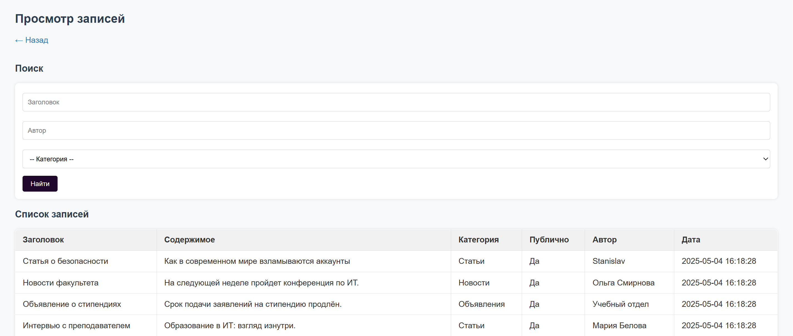
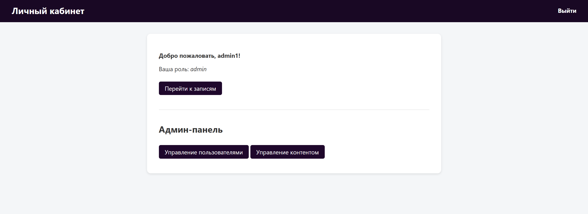
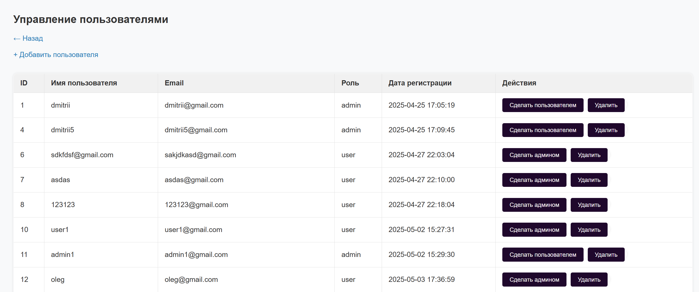
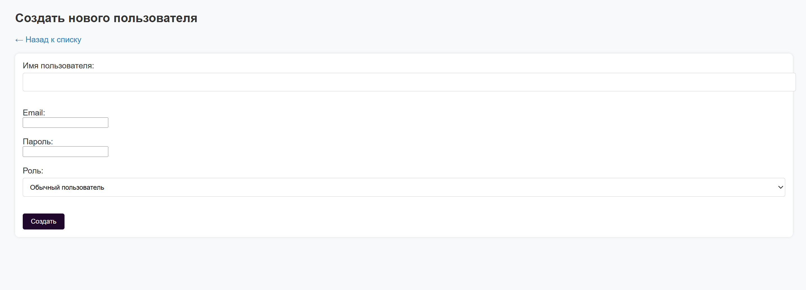
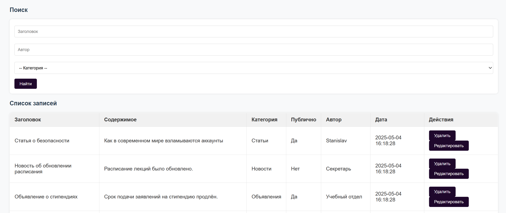
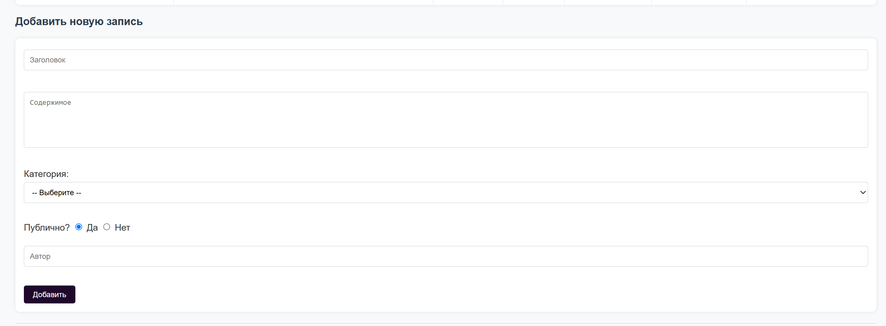

# Индивидуальная работа. Разработка новостного веб-приложения с аутентификацией

## Студенты
**Gachayev Dmitrii I2302**  
**Maximenco Stanislav I2302**

**Выполнено 03.05.2025**  

## Цель работы
Целью работы является разработка защищённого веб-приложения с аутентификацией, взаимодействием с базой данных, управлением пользовательскими ролями и возможностью взаимодействия с контентом через формы.


## Описание работы
Данная работа представляет собой веб-приложение, разработанное с использованием языка PHP в качестве бэкенда и HTML, CSS, JS в качестве фронтенда. В качестве базы данных используется СУБД PostgreSQL. Основная задача — управление пользователями и новостным контентом с разграничением прав доступа. Приложение реализует регистрацию и вход пользователей с безопасным хешированием паролей, проверкой данных и защитой от SQL-инъекций. Интерфейс приложения делится на общедоступную и защищённую части. Авторизованные пользователи могут просматривать записи, а администраторы получают доступ к расширенному функционалу: управлению пользователями и созданию, редактированию и удалению контента. Формы обладают как клиентской, так и серверной валидацией и обеспечивают защиту от некорректных данных. Работа построена по модульному принципу и легко масштабируется.

## Запуск и установка
1. Для работы проекта необходимо установить `PostgreSQL`, создать базу данных, например, `adwli` и повторить архитектуру базы данных:
```sql
CREATE TABLE IF NOT EXISTS users (
    id integer NOT NULL,
    username character varying(50) NOT NULL,
    email character varying(100) NOT NULL,
    password_hash text NOT NULL,
    role character varying(20) DEFAULT 'user'::character varying,
    created_at timestamp without time zone DEFAULT CURRENT_TIMESTAMP
);

CREATE TABLE IF NOT EXISTS content (
    id integer NOT NULL,
    title character varying(255) NOT NULL,
    body text NOT NULL,
    created_at timestamp without time zone DEFAULT CURRENT_TIMESTAMP,
    category character varying(100),
    is_public boolean DEFAULT true,
    author character varying(100)
);
```
2. Настроить подключение к базе данных, изменив конфигурационный файл `config/config.php`:
```php
<?php
function getPDO(): PDO {
    return new PDO("pgsql:host=localhost;port=YOUR_PORT;dbname=YOUR_DATABASE_NAME", "YOUR_LOGING", "YOUR_PASSWORD", [
        PDO::ATTR_ERRMODE => PDO::ERRMODE_EXCEPTION
    ]);
}
```
3. Открыть командную строку в папке проекта и выполнить команду:
```bash
php -S localhost:8000 -t public
```

4. Перейти на `localhost:8000/register.php`

## Документация проекта
### 1. Функциональные возможности
- Регистрация и вход пользователей с безопасным хешированием пароля (через `password_hash()` и `password_verify()`)
- Роли пользователей: **пользователь** и **администратор**
- Доступ к контенту:
  - Пользователи могут просматривать публичные записи (новости)
  - Администраторы могут создавать, редактировать, удалять записи и просматривать приватные записи
  - Также администраторы могут манипулировать пользователями: создавать, удалять, выдавать/забирать админ права
- Поиск и фильтрация контента по:
  - Заголовку
  - Автору
  - Категории
- Валидация данных на клиенте и сервере
- Защита от SQL-инъекций (через PDO `prepare`/`execute`)
- Проверка уникальности указываемых логинов и почт, в том числе при создании администратором
- Все манипуляции отображаются в базе данных

Подобные стили применяются на всех страницах доступных юзерам, для соблюдения одного визуального представления приложения:
```css
body {
    margin: 0;
    padding: 0;
    font-family: "Segoe UI", sans-serif;
    background: #f0f4f7;
    display: flex;
    justify-content: center;
    align-items: center;
    height: 100vh;
}

.register-container {
    background: white;
    padding: 2rem;
    border-radius: 10px;
    box-shadow: 0 2px 10px rgba(0, 0, 0, 0.1);
    width: 100%;
    max-width: 400px;
    text-align: center;
}

.register-form {
    display: flex;
    flex-direction: column;
    gap: 1rem;
}

input {
    padding: 0.8rem;
    font-size: 1rem;
    border: 1px solid #ccc;
    border-radius: 5px;
}

button[type="submit"] {
    background: #1f082c;
    color: white;
    border: none;
    padding: 0.8rem;
    font-size: 1rem;
    border-radius: 5px;
    cursor: pointer;
}

button[type="submit"]:hover {
    background: #591f6b;
}

.error-box {
    background: #e74c3c;
    color: white;
    padding: 0.5rem;
    margin-bottom: 1rem;
    border-radius: 5px;
}

.password-wrapper {
    position: relative;
}

#toggleRegPassword {
    position: absolute;
    right: 10px;
    top: 50%;
    transform: translateY(-50%);
    background: none;
    border: none;
    cursor: pointer;
    font-size: 1rem;
}
```

### 2. Сценарии взаимодействия пользователей с приложением

#### Незарегистрированный пользователь
- Не может ничего просматривать (происходит редирект на `login` при попытке насильно перейти в `dashboard`)
- Может перейти на страницу регистрации или входа

#### Зарегистрированный пользователь
- Входит в систему
- Получает доступ к панели (`dashboard`)
- Может просматривать все публичные записи (новости)

#### Администратор
- Входит в защищённый раздел
- Управляет пользователями (создание, назначение ролей, удаление)
- Управляет контентом (создание, редактирование, удаление)
- Имеет доступ к административным страницам (`/admin/users.php`, `/admin/create_user.php`.)

#### Структура базы данных

Таблица `users`:
| Поле         | Тип           | Назначение                        |
|--------------|----------------|-----------------------------------|
| `id`         | `serial`       | Первичный ключ                   |
| `username`   | `varchar(100)` | Уникальное имя пользователя      |
| `email`      | `varchar(100)` | Уникальный email                 |
| `password_hash` | `text`      | Хеш пароля                       |
| `role`       | `varchar(10)`  | Роль (`user` или `admin`)       |
| `created_at` | `timestamp`    | Дата регистрации                 |

Таблица `content`:
| Поле         | Тип           | Назначение                        |
|--------------|----------------|-----------------------------------|
| `id`         | `serial`       | Первичный ключ                   |
| `title`      | `varchar(100)` | Заголовок записи                 |
| `body`       | `text`         | Текст записи                     |
| `category`   | `varchar(50)`  | Категория (`Новости`, `Статьи`, `Объявления`)|
| `is_public`  | `boolean`      | Публичность записи               |
| `author`     | `varchar(100)` | Имя автора                       |
| `created_at` | `timestamp`    | Дата создания                    |

## Примеры использования проекта
Первое взаимодействие пользователя с проектом происходит на `/register.php`:



Уже зарегистрированные пользователи могут войти в свой аккаунт на `/login.php`:



После успешного входа пользователь попадает в личный кабинет, откуда может выйти или перейти к новостным записям:



Далее открывается меню записей, в котором пользователи могут их просматривать и осуществлять поиск по заголовкам, категориям и авторам. Пользователи видят только публичные записи и не могут их изменять:



В случае если пользователь - администратор (можно выдать напрямую через бд или с другого админ аккаунта), в личном кабинете открывается дополнительный функционал, а именно управление контентом и пользователями:



Меню управления пользователями позволяет изменять уже существующих юзеров, выдавать/забирать админ права, удалять их:



Также из этого меню открывается возможность перейти в `/admin/create_user.php`, чтобы создать пользователя (валидация работает и здесь):



Меню управления контентом позволяет удалять и редактировать существующие записи (валидация работает и здесь):



Также появляется дополнительная форма на создание нового контента:



## Источники
1. [PHP: Официальная документация](https://www.php.net/manual/ru/)  
2. [PostgreSQL: Официальная документация](https://www.postgresql.org/docs/current/)
3. [PHP PDO](https://www.php.net/manual/ru/book.pdo.php)
4. [OWASP SQL Injection Prevention Cheat Sheet](https://cheatsheetseries.owasp.org/cheatsheets/SQL_Injection_Prevention_Cheat_Sheet.html)  
5. [HTML: w3schools documentation](https://www.w3schools.com/html/)
6. [CSS: w3schools documentation](https://www.w3schools.com/css/)
7. [Javascript: w3schools documentation](https://www.w3schools.com/js/)

## Вывод
В ходе выполнения проекта было разработано веб-приложение с поддержкой аутентификации, управлением ролями пользователей и системой управления контентом. Приложение реализует основные принципы безопасности, включая хеширование паролей, защиту от SQL-инъекций с использованием подготовленных выражений (PDO), а также базовую валидацию данных на стороне клиента и сервера. Для улучшения пользовательского опыта применены стилизованные формы, интерактивные элементы управления и визуальные подсказки. Визуальный интерфейс оформлен в едином минималистичном стиле: таблицы, кнопки и формы адаптированы под современный пользовательский опыт. Приложение построено по модульному принципу, что позволяет легко масштабировать и дополнять его новым функционалом.
